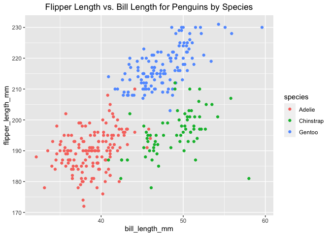

p8105\_hw1\_hlz2108
================

This is my solution to HW1.

``` r
library(tidyverse)
```

    ## ── Attaching packages ──────────────────────────────────────────────────────── tidyverse 1.3.0 ──

    ## ✓ ggplot2 3.3.2     ✓ purrr   0.3.4
    ## ✓ tibble  3.0.3     ✓ dplyr   1.0.2
    ## ✓ tidyr   1.1.2     ✓ stringr 1.4.0
    ## ✓ readr   1.3.1     ✓ forcats 0.5.0

    ## ── Conflicts ─────────────────────────────────────────────────────────── tidyverse_conflicts() ──
    ## x dplyr::filter() masks stats::filter()
    ## x dplyr::lag()    masks stats::lag()

## Problem 1

The data chunk below creates a data frame comprised of:

  - a random sample of size 10 from a standard Normal distribution
  - a logical vector indicating whether elements of the sample are
    greater than 0
  - a character vector of length 10
  - a factor vector of length 10, with 3 different factor “levels”

<!-- end list -->

``` r
prob1_df =
  tibble(
    samp = rnorm(10),
    samp_gt_0 = samp > 0,
    char_vec = c("a", "b", "c", "d", "e", "f", "g", "h", "i", "j"),
    factor_vec = factor(c("low", "low", "low", "mod", "mod", "mod", " mod", "high", "high", "high"))
  )
```

Taking the mean of each variable in my data frame.

``` r
mean(pull(prob1_df, samp))
```

    ## [1] -0.1115698

``` r
mean(pull(prob1_df, samp_gt_0))
```

    ## [1] 0.5

``` r
mean(pull(prob1_df, char_vec))
```

    ## Warning in mean.default(pull(prob1_df, char_vec)): argument is not numeric or
    ## logical: returning NA

    ## [1] NA

``` r
mean(pull(prob1_df, factor_vec))
```

    ## Warning in mean.default(pull(prob1_df, factor_vec)): argument is not numeric or
    ## logical: returning NA

    ## [1] NA

I can take the mean of numbers and logical but not character or factor.

This code chunk below applies the *as.numeric* function to the logical,
character, and factor variables.

``` r
as.numeric(pull(prob1_df, samp))
as.numeric(pull(prob1_df, samp_gt_0))
as.numeric(pull(prob1_df, char_vec))
as.numeric(pull(prob1_df, factor_vec))
```

``` r
as.numeric((pull(prob1_df, samp_gt_0))) * pull(prob1_df, samp)
```

    ##  [1] 0.00000000 1.03715036 0.05977659 0.00000000 1.35407313 0.13053507
    ##  [7] 0.00000000 0.98470713 0.00000000 0.00000000

``` r
as.factor((pull(prob1_df, samp_gt_0))) * pull(prob1_df, samp)
```

    ## Warning in Ops.factor(as.factor((pull(prob1_df, samp_gt_0))), pull(prob1_df, :
    ## '*' not meaningful for factors

    ##  [1] NA NA NA NA NA NA NA NA NA NA

## Problem 2

The code chunk below loads the **Penguins** dataset from the
*palmerpenguins* package.

``` r
data("penguins", package = "palmerpenguins")
```

The **Penguins** dataset contains the following variables:
bill\_depth\_mm, bill\_length\_mm, body\_mass\_g, flipper\_length\_mm,
island, sex, species, year.

Bill Depth (mm) is a numeric variable. The mean bill depth (mm) is
17.1511696. Values for bill depth range from 13.1, 21.5.

Bill Length (mm) is a numeric variable. The mean bill length (mm) is
43.9219298. Values for bill length range from 32.1, 59.6.

Body Mass (g) is a integer variable. The mean body mass (g) is
4201.754386. Values for body mass range from 2700, 6300.

Flipper Length (mm) is a integer variable. The mean flipper length in mm
is 200.9152047. Values for flipper length range from 172, 231.

Island is a factor variable, which is broken into Biscoe, Dream,
Torgersen islands.

Sex is a factor variable. The different categories for sex are female,
male.

Species is a factor variable, which is broken into the species Adelie,
Chinstrap, Gentoo.

Year is a integer variable. The range for the years variable is from
2007, 2009.

The number of rows (observations) in the Penguin dataset is 344.

The number of columns (variables) in the Penguin dataset is 8.

This code chunk below generates a scatter plot for bill length and
flipper length, each color represents a different species.

``` r
ggplot(penguins, aes (x = bill_length_mm, y = flipper_length_mm, color = species)) + geom_point() + ggtitle("Flipper Length vs. Bill Length for Penguins by Species") + theme(plot.title = element_text(hjust = 0.5))
```

    ## Warning: Removed 2 rows containing missing values (geom_point).

<!-- -->

``` r
ggsave("scatterplot_penguin.pdf")
```

    ## Saving 7 x 5 in image

    ## Warning: Removed 2 rows containing missing values (geom_point).
